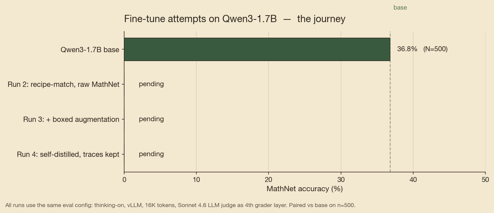

# mathnet-eval-harness

Five frontier LLMs and an open-weights 1.7B base — with a QLoRA fine-tune on top — measured against 500 Olympiad-level problems from the [MathNet](https://huggingface.co/datasets) benchmark. Where does fine-tuning still add value when the open base already matches the cheap commercial tier?

## Scoreboard

| Model | N scored | **MathNet accuracy** | Eval cost |
|---|---|---|---|
| Claude Opus 4.7 | 100 | **84.0%** | $6.14 |
| Gemini 3 Pro | 240 / 300 | **73.3%** | $13.55 |
| Claude Sonnet 4.6 | 500 | **65.0%** | $10.35 |
| GPT-5.4 | 495 / 500 | **57.8%** | $9.52 |
| **Qwen3-1.7B base**  *(open, thinking-on, vLLM, 16K)* | 500 | **36.8%** | — |
| GPT-5.4 Mini | 498 / 500 | **36.7%** | $1.51 |
| Qwen3-1.7B + Run 4 self-distill *(ours)* | 500 | **28.8%** | — |


Full methodology, caveats, and secondary findings: [docs/findings.md](docs/findings.md).

## Key findings

- **A current-gen 1.7B open-weights base already matches GPT-5.4 Mini.** Qwen3-1.7B with thinking-on, served via vLLM at 16K-token budget, scores **36.8%** vs Mini's **36.7%** on the same 500-problem split. No fine-tuning. This re-anchors the project: we initially targeted Mini at 36.7% as the bar a 1.5B QLoRA needed to clear, but the open base already clears it. The new question is **where fine-tuning still adds value on top of an already-competitive open base.**
- **The 36.8% / 36.7% parity is not apples-to-apples.** Both models run "in their preferred inference mode" (Qwen3 thinking-on at 16K via vLLM; Mini with OpenAI's default reasoning settings). Identical-constraint comparisons would land somewhere different.
- **Sonnet 4.6 beats GPT-5.4 by 7pp** at comparable cost (65.0% vs 57.8%, $10.35 vs $9.52). The Anthropic lineage outperforms the OpenAI lineage on MathNet-style olympiad problems in our setup.
- **The 4-layer grading pipeline (exact → normalized → sympy → LLM judge) reduces LLM-judge spend by ~40%** vs judge-everything. 41% of correct grades resolve on the objective non-judge layers.
- **GPT-5 family has elevated `miss` rates even after the judge runs.** Investigated on a pre-registered 40-sample manual audit: 85% are genuine model errors, only 10% are grader artifacts — below the 15% pre-registered fix threshold. Numbers stand. See [docs/gpt-missrate-analysis.md](docs/gpt-missrate-analysis.md).
- **Same 63% miss rate on Qwen3 base and GPT-5.4 Mini, different causes.** Mini misses are mostly genuine wrong answers (Day-3 categorization). Qwen3 misses are dominated by **convergence failure** — 35% of Qwen3 outputs hit the 16K token ceiling without emitting a final answer. Fine-tuning on solution+answer training data should target this specifically.


## Why none of our fine-tunes beat the base

Across four QLoRA configurations spanning every sensible knob (base model, recipe, LoRA rank, data scale, loss masking, augmentation, self-distillation), **every fine-tune ended below the 36.8% post-trained Qwen3-1.7B base.** Run 4 — our cleanest attempt, training only on the base's *own* correct reasoning traces — closed the gap from -34 pp (Runs 2/3) to **-8 pp**, but couldn't push past base.



**The mechanism, diagnosed cleanly from the eval data:** fine-tuning *amplified* the convergence-failure mode the base was already prone to. Run 4 has *more* saturation than base (198 vs 157 outputs hit the 16K-token cap), and 53% of its misses are *saturated AND no `\boxed{}`* — the model thinks past the budget without ever committing to a final answer.

The reason is mechanical. Base produces long reasoning traces (median ~14K tokens with `<think>` blocks). Run 4 trained on those long traces — so the resulting model thinks *longer*. On problems Run 4 can solve, this is fine. On problems it can't, the model spirals into recomputation loops past the 16K ceiling without converging.

### A concrete illustration: problem `0ai2`

> *2014 lines are given in a plane, arranged in three groups of pairwise parallel lines. What is the greatest possible number of triangles formed by the lines?* (gold answer: **302561952**)

**Qwen3-1.7B base solved this in 5,271 tokens.** Clean reasoning: maximize $a \cdot b \cdot c$ subject to $a + b + c = 2014$ → pick $(671, 671, 672)$ → compute $671 \cdot 671 \cdot 672 = 302{,}561{,}952$ → `\boxed{302561952}`. Done.

**Run 4 saturated at 16,384 tokens with no answer.** It picked the wrong distribution (672, 672, 670 — slightly off) and got 302,561,280 (wrong by 672). Then second-guessed itself — *"Wait, earlier I had 755,728,512..."* — and spent the remaining ~10,000 tokens re-factoring the expression in different ways:

> *"Total = 672 × [672 × 670 + (672 × 671 + 671 × 670 + 670 × 669)/2]<br>
> Which is what I had before, leading to 672 × 1,124,596 ="*

— and runs out of tokens mid-arithmetic, never committing to a final answer.

This is the failure mode generalized: the fine-tune produced a model that *can* arrive at correct intermediate values, but lost the base's discipline of **picking one approach and finishing**. Trained on long-trace data, it learned to *keep thinking* past the point where the base would have boxed an answer and stopped.

### The bigger framing

At 1.7B, the post-trained Qwen3 base appears to sit at a local optimum hard to disturb without breaking. Self-distillation reduced the *damage* of fine-tuning (Runs 2/3 = -34 pp; Run 4 = -8 pp), but didn't push above. **Surpassing the open base at this size likely requires methods structurally different from any we tested:**

- **RL** ([GRPO](https://arxiv.org/abs/2402.03300) / [rStar-Math](https://arxiv.org/abs/2501.04519)) — avoids the supervision-length problem entirely
- **Distillation from a stronger teacher** (e.g., Sonnet 4.6 / DeepSeek-R1 traces) — relabels the supervision target with cleaner, more decisive reasoning
- **Continued pretraining on a larger math corpus** (Llemma's Proof-Pile-2 at 55B tokens) — different scale entirely

These are documented as Week 2-4 follow-on work. None are addressable in Week 1.

Full per-run journey, methodology caveats, and the literature backing this interpretation: [docs/findings.md](docs/findings.md).

## Architecture


MathNet (27,817 problems) → English/text/has-answer filters → stratified splits (500 eval / 3,596 train / 14,585 multilingual train) → unified inference harness (5 API backends + local HF / vLLM with disk cache) → 4-layer grading pipeline → committed JSON results per problem.

## Reproducing

```bash
# 1. Clone + install
git clone https://github.com/sanmarcog/mathnet-eval-harness.git
cd mathnet-eval-harness
pip install -e .

# 2. Configure API keys (Anthropic / OpenAI / Google) for frontier eval
cp .env.example .env
# edit .env

# 3. Build the eval / train splits from MathNet
python scripts/build_splits.py --out data/splits

# 4. Frontier eval (example: Claude Sonnet 4.6 on 20 problems)
python scripts/run_eval.py --model sonnet-4-6 --split eval --n 20

# 5. Open-base eval (Qwen3-1.7B via vLLM, thinking-on, 16K)
sbatch slurm/eval_qwen3_base.sbatch

# 6. QLoRA training on the UW Hyak cluster (A40 GPU)
sbatch slurm/train_qlora_run2.sbatch
```

Full 500-problem frontier eval costs **~$41 end-to-end**. Local training requires a GPU with ≥24 GB VRAM; an interactive slot on Hyak is:

```bash
salloc --account=demo --partition=ckpt-all --gpus-per-node=a40:1 \
       --mem=32G --cpus-per-task=4 --time=4:00:00
```

## Repo structure

```
src/mathnet_eval/     # core library (importable)
  data.py             # MathNet loading, stratified splits, prompt formatting
  inference.py        # unified client for Claude / OpenAI / Gemini / local HF + vLLM
  grading.py          # 4-layer grader: exact → normalized → sympy → judge
  training.py         # QLoRA training loop (TRL SFTTrainer)
scripts/              # CLI entrypoints (argparse → library calls)
  merge_adapter.py    # post-training PEFT merge into bf16 weights for vLLM serving
  make_figures.py     # headline figure generation
slurm/                # sbatch scripts for Hyak (ckpt-all partition)
results/              # committed JSON outputs and figures
  full/               # 500-problem runs, per-model subdirs
  figures/            # headline plots
docs/                 # findings report, methodology notes, investigations
tests/                # pytest unit tests
```

## Tech stack

Python 3.11 · HuggingFace transformers / peft / trl / bitsandbytes · vLLM · Anthropic + OpenAI + Google GenAI SDKs · PyTorch · UW Hyak Klone (Slurm, A40 GPU).

## Blog

Write-up (pending Run 2 training completion): [docs/blog_post.md](docs/blog_post.md)

---

*Portfolio project. Week 1 of 4 — first commit 2026-04-22.*
