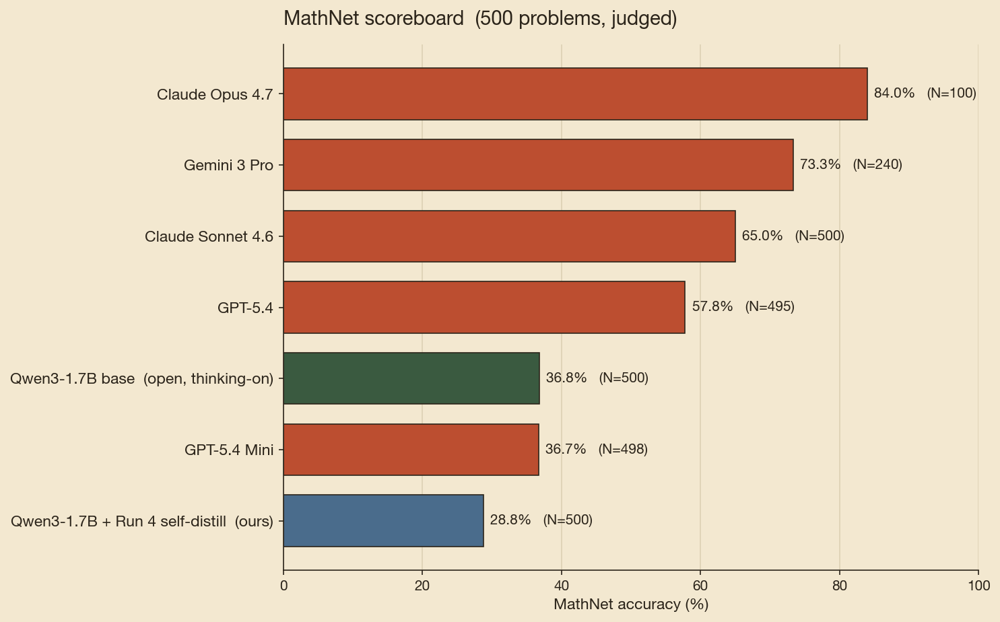
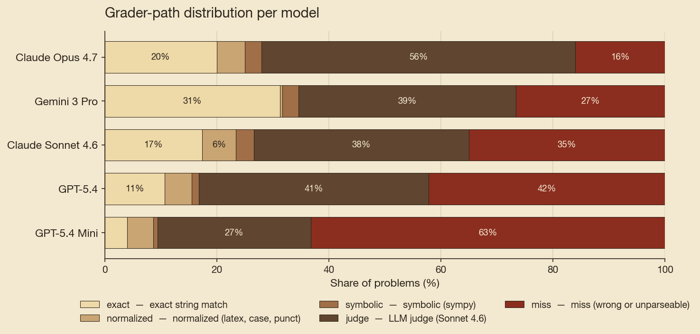
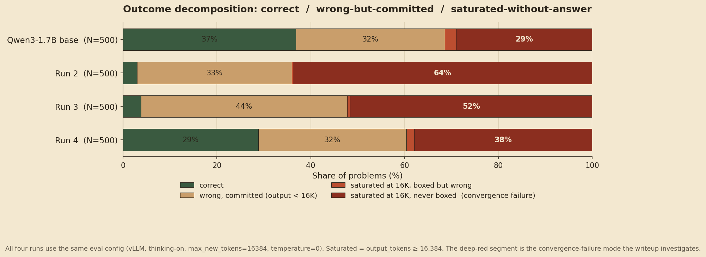
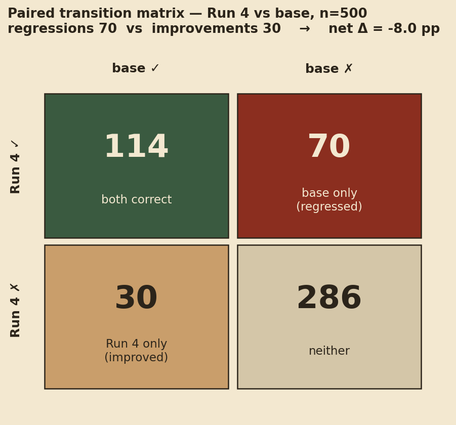
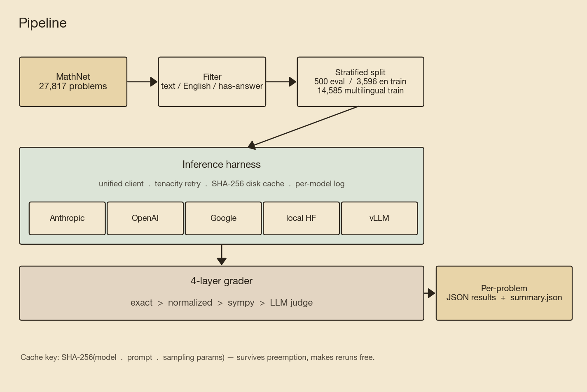

# mathnet-eval-harness

Five frontier LLMs and an open-weights 1.7B base (with a QLoRA fine-tune on top) measured against 500 Olympiad-level problems from the [MathNet](https://huggingface.co/datasets) benchmark. Where does fine-tuning still add value when the open base already matches the cheap commercial tier?

## Scoreboard

| Model | N scored | **MathNet accuracy** | Eval cost |
|---|---|---|---|
| Claude Opus 4.7 | 100 | **84.0%** | $6.14 |
| Gemini 3 Pro | 240 / 300 | **73.3%** | $13.55 |
| Claude Sonnet 4.6 | 500 | **65.0%** | $10.35 |
| GPT-5.4 | 495 / 500 | **57.8%** | $9.52 |
| **Qwen3-1.7B base**  *(open, thinking-on, vLLM, 16K)* | 500 | **36.8%** | — |
| GPT-5.4 Mini | 498 / 500 | **36.7%** | $1.51 |
| Qwen3-1.7B + Run 4 self-distill *(ours)* | 500 | **28.8%** | — |

*Eval cost is generation-side only: it excludes the Sonnet-4.6 LLM-judge API spend, which runs on every problem the cheap grader layers don't resolve (typically 30-40% of problems per model). True total spend is ~10-20% higher than the per-row figures shown. Tracking the judge spend per-call is on the followup list. Opus N=100 spot-check by budget; Gemini N=240 of 300 target due to a preview-model daily cap; GPT-5.4 / Mini denominators are `n_scored` after OpenAI safety-filter rejections (5 / 500 and 2 / 500).*



Full methodology, caveats, and secondary findings: [docs/findings.md](docs/findings.md).

## Key findings

- **A current-gen 1.7B open-weights base already matches GPT-5.4 Mini.** Qwen3-1.7B with thinking-on, served via vLLM at 16K-token budget, scores **36.8%** vs Mini's **36.7%** on the same 500-problem split. No fine-tuning. **Paired McNemar on the n=498 intersection: 184 vs 183 correct, exact two-sided p = 1.0000** (145 discordant pairs, near-perfectly balanced 73 / 72). This re-anchors the project: we initially targeted Mini at 36.7% as the bar a 1.5B QLoRA needed to clear, but the open base already clears it. The new question is **where fine-tuning still adds value on top of an already-competitive open base.**
- **Parity in aggregate, not per-problem.** Same headline accuracy, but the two models disagree on 145 / 498 problems (they reach the same rate by solving substantially different subsets). So the parity finding is "the open ecosystem has caught up to the cheap commercial tier in mean accuracy," not "Qwen3-1.7B is GPT-5.4 Mini."
- **The parity is not apples-to-apples in inference setup.** Both models run "in their preferred inference mode" (Qwen3 thinking-on at 16K via vLLM; Mini with OpenAI's default reasoning settings). 
- **Sonnet 4.6 beats GPT-5.4 by 7 pp** at comparable cost (65.0% vs 57.8%, $10.35 vs $9.52). **Paired McNemar on the n=495 intersection: 324 vs 286 correct, exact two-sided p = 0.0019** (144 discordant pairs, 91 Sonnet-only vs 53 GPT-only). The Anthropic lineage outperforms the OpenAI lineage on MathNet-style olympiad problems in our setup, by an effect well past noise.
- **The 4-layer grading pipeline (exact → normalized → sympy → LLM judge) reduces LLM-judge spend by ~40%** vs judge-everything. 41% of correct grades resolve on the objective non-judge layers.
- **GPT-5 family has elevated `miss` rates even after the judge runs.** Investigated on a pre-registered 40-sample manual audit: 85% are genuine model errors, only 10% are grader artifacts.  See [docs/gpt-missrate-analysis.md](docs/gpt-missrate-analysis.md).
- **Same 63% miss rate on Qwen3 base and GPT-5.4 Mini, different causes.** Mini misses are mostly genuine wrong answers (Day-3 categorization). Qwen3 misses are dominated by **convergence failure**: 35% of Qwen3 outputs hit the 16K token ceiling without emitting a final answer. Fine-tuning on solution+answer training data should target this specifically.



## Why none of our fine-tunes beat the base

Across four QLoRA configurations spanning every sensible knob (base model, recipe, LoRA rank, data scale, loss masking, augmentation, self-distillation), **every fine-tune ended below the 36.8% post-trained Qwen3-1.7B base.** Our cleanest attempt, Run 4 (training only on the base's *own* correct reasoning traces) closed the gap from -34 pp (Runs 2/3) to **-8 pp**, but couldn't push past base.

**The mechanism, diagnosed cleanly from the eval data:** fine-tuning *amplified* the convergence-failure mode the base was already prone to. Run 4 has *more* saturation than base (198 vs 157 outputs hit the 16K-token cap), and 53% of its misses are *saturated AND no `\boxed{}`*. The model thinks past the budget without ever committing to a final answer.



The deep-red segment (saturated outputs that never emit a final answer) grows from base to Run 4. All four runs share the same 16K-token cap, same vLLM backend, same `temperature=0`; the comparison is uncontaminated.

The reason is mechanical. Base produces long reasoning traces (median ~14K tokens with `<think>` blocks). Run 4 trained on those long traces, so the resulting model thinks *longer*. On problems Run 4 can solve, this is fine. On problems it can't, the model spirals into recomputation loops past the 16K ceiling without converging.

### A concrete illustration: problem `0ai2`

> *2014 lines are given in a plane, arranged in three groups of pairwise parallel lines. What is the greatest possible number of triangles formed by the lines?* (gold answer: **302561952**)

**Qwen3-1.7B base solved this in 5,271 tokens.** Clean reasoning: maximize $a \cdot b \cdot c$ subject to $a + b + c = 2014$ → pick $(671, 671, 672)$ → compute $671 \cdot 671 \cdot 672 = 302{,}561{,}952$ → `\boxed{302561952}`. Done.

**Run 4 saturated at 16,384 tokens with no answer.** It picked the wrong distribution (672, 672, 670 — slightly off) and got 302,561,280 (wrong by 672). Then second-guessed itself — *"Wait, earlier I had 755,728,512..."* — and spent the remaining ~10,000 tokens re-factoring the expression in different ways:

> *"Total = 672 × [672 × 670 + (672 × 671 + 671 × 670 + 670 × 669)/2]<br>
> Which is what I had before, leading to 672 × 1,124,596 ="*

— and runs out of tokens mid-arithmetic, never committing to a final answer.

This is the failure mode generalized: the fine-tune produced a model that *can* arrive at correct intermediate values, but lost the base's discipline of **picking one approach and finishing**. Trained on long-trace data, it learned to *keep thinking* past the point where the base would have boxed an answer and stopped.



The paired n=500 picture: regressions outnumber improvements roughly 2:1. Run 4 is not "uniformly weaker", it shifts the distribution, breaking more than it fixes. McNemar exact two-sided p ≈ 0.0001.

### The bigger framing

At 1.7B, the post-trained Qwen3 base appears to sit at a local optimum hard to disturb without breaking. Self-distillation reduced the *damage* of fine-tuning (Runs 2/3 = -34 pp; Run 4 = -8 pp), but didn't push above. **Surpassing the open base at this size likely requires methods structurally different from any we tested:**

- **Policy-gradient RL** ([GRPO](https://arxiv.org/abs/2402.03300), DeepSeekMath) — avoids the supervision-length problem entirely. The model generates its own traces and the reward is on the final answer, so no teacher distribution biases trace length upward.
- **Test-time MCTS search with self-evolved data** ([rStar-Math](https://arxiv.org/abs/2501.04519)) — different mechanism from GRPO: Monte Carlo Tree Search at inference plus a process preference model trained on self-evolved traces. Reports Qwen2.5-Math-7B 58.8% → 90.0% on MATH; demonstrated only on 7B and 3.8B, not 1.7B.
- **Distillation from a stronger external teacher** (e.g., Sonnet 4.6 / DeepSeek-R1 traces) — relabels the supervision target with cleaner, more decisive reasoning. Cost-prohibitive for the project budget but the most direct fix for our specific saturation-amplification mechanism.
- **Continued pretraining on a larger math corpus** ([Llemma](https://arxiv.org/abs/2310.10631) and its Proof-Pile-2 dataset) — different scale entirely

Full per-run journey, methodology caveats, and the literature backing this interpretation: [docs/findings.md](docs/findings.md).

## Run-by-run methodology and references

For each fine-tune attempt, we describe the precise training-script spec, the prior work that justified trying it, and the literature (or own diagnosis) explaining why it didn't beat the base. Citations are marked **✓ verified** (existing bibliography explains the issue), or **📊 own diagnosis** (no peer-reviewed source, derived from our own eval data).

### Run 2 — recipe-match Alibaba's Qwen2.5-Math 1.5B

**What it does** ([slurm/train_qlora_run2.sbatch](slurm/train_qlora_run2.sbatch)): QLoRA on Qwen3-1.7B (4-bit NF4), `r=64 / alpha=128` on q/k/v/o + gate/up/down. LR `2e-5`, effective batch **128** (per-device 4 × grad-accum 32), **3 epochs**, `max_seq_length=4096`, `completion_only_loss=True`, thinking-OFF chat template. Training data: 11,648 multilingual MathNet rows, filtered to drop empty/<100-token solutions.

**Prior work and why we tried it:**
- ✓ **Qwen2.5-Math Technical Report** ([arxiv 2409.12122](https://arxiv.org/abs/2409.12122), Yang et al. 2024) — the only known successful math fine-tune in this family at this size. Their published 1.5B recipe is exactly LR 2×10⁻⁵, batch 128, 3 epochs, seq 4,096. We matched all four numerical knobs.

**Why it didn't work at -33.8 pp paired:**
- ✓ **Catastrophic forgetting at small scale** ([arxiv 2512.13706](https://arxiv.org/abs/2512.13706), Reynolds 2025) — Flan-T5-Base loses 64.5 pp on NLI within 1,000 steps of math-only fine-tuning. Aggressive narrow-domain training degrades general abilities the model needs.
- 📊 **Data-scale gap** — Alibaba trained on 2.5M RM-curated CoT problems; we trained on 11,648 raw MathNet rows. ~200× less data, uncurated. The recipe was tuned for a data scale we couldn't match.

### Run 3 — Run 2 + boxed-answer augmentation

**What it does** ([slurm/train_qlora_run3.sbatch](slurm/train_qlora_run3.sbatch)): identical to Run 2, except every training row's solution gets `\n\nTherefore, the final answer is $\boxed{<final_answer>}$` appended.

**Prior work and why we tried it:**
- 📊 **No specific peer-reviewed precedent.** Format augmentation in math fine-tuning is engineering folklore. The internal hypothesis was: if base emits `\boxed{}` 65% of the time and MathNet rows contain it 1.5%, the fine-tune may have unlearned the convention. Run 3 was a single-variable test of that.

**Why it didn't work at -33.0 pp paired:**
- 📊 **Format restored, math broken** (own diagnosis from Run 3 outputs): 41.8% of Run 3 outputs emit `\boxed{}` (close to base's 65%) — the augmentation worked. But the *content* inside the boxes is wrong nearly every time (~9% correct-among-boxed vs base's 57%). Format and capability are independent.
- ✓ **Same catastrophic-forgetting mechanism as Run 2** ([arxiv 2512.13706](https://arxiv.org/abs/2512.13706)). Adding format supervision doesn't reverse the underlying capability damage from aggressive SFT on a narrow domain.

### Run 4 — self-distillation on base's own correct outputs

**What it does** ([slurm/train_qlora_run4_n150.sbatch](slurm/train_qlora_run4_n150.sbatch)): QLoRA on Qwen3-1.7B with **thinking-ON** chat template. LR `1e-5` (half of Run 2/3), effective batch **4** (per-device 1 × grad-accum 4), **2 epochs**, `max_seq_length=8192` (doubled to fit long traces), `completion_only_loss=True`. Training data: 146 rows where base Qwen3-1.7B solved a training problem and `extract_answer` matched gold; full `<think>...</think>` traces preserved verbatim. **Caveat:** N=146 is small enough that a different sample of base-correct rows could plausibly produce a different result. The paired McNemar test catches that the difference vs base is real (p ≈ 10⁻⁴) but does not bound how the *direction* would shift on a re-sampled distillation set.

**Prior work and why we tried it (three direct precedents):**
- ✓ **STaR** ([arxiv 2203.14465](https://arxiv.org/abs/2203.14465), Zelikman et al. 2022) — the original self-taught-reasoner loop: generate rationales, keep the ones that yield correct answers, fine-tune on those, repeat.
- ✓ **RFT** ([arxiv 2308.01825](https://arxiv.org/abs/2308.01825), Yuan et al. 2023, "Scaling Relationship on Learning Mathematical Reasoning") — defines rejection-sampling fine-tuning explicitly; reports LLaMA-7B 35.9% → 49.3% on GSM8K.
- ✓ **LIMO** ([arxiv 2502.03387](https://arxiv.org/abs/2502.03387), Ye et al. 2025) — sophisticated reasoning emerges from a few well-chosen examples in models with strong foundations; offers loose precedent for trying with ~150 rows. **Caveat:** LIMO operates at 32B; the follow-up [LIMR (arxiv 2502.11886)](https://arxiv.org/abs/2502.11886) explicitly reports LIMO "significantly underperforms at 7B-scale through SFT." Our use at 1.7B inherits that limitation, so this citation justifies attempting the recipe but does not predict success at our scale.

**Why it didn't work at -8 pp paired (p ≈ 10⁻⁴):**
- ✓ **Self-distillation degradation on Qwen3-1.7B is directly documented** ([arxiv 2603.24472](https://arxiv.org/abs/2603.24472), Kim et al., "Why Does Self-Distillation (Sometimes) Degrade the Reasoning Capability of LLMs?"). Appendix F.2 reports **-45.9% degradation on Qwen3-1.7B with thinking mode ON** — our exact base and inference setting. **But the method differs:** Kim et al. study off-policy SFT where the teacher conditions on the gold solution, plus on-policy SDPO; Run 4 is rejection-sampled SFT where the teacher generates without seeing gold. Their identified mechanism "conditioning the teacher on rich information suppresses uncertainty expression, hurting OOD" is structurally absent from our setup, which is why our -8 pp paired delta is a fraction of their -45.9%. The literature predicts severe collapse for solution-conditioned distillation at this scale; the gentler regression we measured is consistent with avoiding that mechanism, but a different mechanism (📊 below) bit us anyway.
- 📊 **Our specific failure mechanism is own diagnosis** (from eval data, not literature): training on base's long reasoning traces (median ~14K tokens with `<think>` blocks) taught the model to *think longer*, amplifying the convergence-failure mode the base was already prone to. Run 4 saturated 198 outputs at 16K vs base's 157; **53% of Run 4's misses are saturated AND never boxed.** Concrete illustration: problem `0ai2` (base solved in 5,271 tokens with `\boxed{302561952}`; Run 4 saturated at 16,384 tokens with no answer), see the section above.

## Architecture



MathNet (27,817 problems) → English/text/has-answer filters → stratified splits (500 eval / 3,596 train / 14,585 multilingual train) → unified inference harness (5 API backends + local HF / vLLM with disk cache) → 4-layer grading pipeline → committed JSON results per problem.

## Reproducing

```bash
# 1. Clone + install (frontier-API-only path)
git clone https://github.com/sanmarcog/mathnet-eval-harness.git
cd mathnet-eval-harness
pip install -e .

# 1b. Add GPU extras if you also want to run training or vLLM-served local evals
pip install -e ".[gpu]"     # adds bitsandbytes, vllm

# 2. Configure API keys (Anthropic / OpenAI / Google) for frontier eval
cp .env.example .env
# edit .env

# 3. Build the eval / train splits from MathNet
python scripts/build_splits.py --out data/splits

# 4. Frontier eval (example: Claude Sonnet 4.6 on 20 problems)
python scripts/run_eval.py --model sonnet-4-6 --split eval --n 20

# 5. Open-base eval (Qwen3-1.7B via vLLM, thinking-on, 16K)
sbatch slurm/eval_qwen3_base.sbatch

# 6. QLoRA training on the UW Hyak cluster (A40 GPU)
sbatch slurm/train_qlora_run2.sbatch
```

Full 500-problem frontier eval costs **~$41 end-to-end** (generation-side; excludes LLM-judge spend per the scoreboard footnote). Local training requires a GPU with ≥24 GB VRAM; an interactive slot on Hyak is:

```bash
salloc --account=demo --partition=ckpt-all --gpus-per-node=a40:1 \
       --mem=32G --cpus-per-task=4 --time=4:00:00
```

### Cluster portability

The sbatch scripts in `slurm/` are written for **UW Hyak Klone** specifically. Adapting them to another Slurm cluster requires editing the following hardcoded paths/flags in each sbatch (most live in the first ~50 lines):

| What | Hyak default | Where it lives |
|---|---|---|
| `--account` | `demo` | sbatch `#SBATCH --account=...` |
| `--partition` | `ckpt-all` | sbatch `#SBATCH --partition=...` |
| `REPO` | `/gscratch/scrubbed/sanmarco/mathnet-eval-harness` | sbatch body |
| `PY` (interpreter) | `/gscratch/scrubbed/sanmarco/conda/envs/qlora/bin/python` | sbatch body |
| `ADAPTERS_ROOT` | `/gscratch/scrubbed/sanmarco/adapters` | training sbatches |
| `HF_HOME` | `/gscratch/scrubbed/sanmarco/hf_cache` | sbatch body |

The CLI scripts under `scripts/` (e.g. `run_eval.py`, `eval_qwen_hf.py`, `grade_results.py`, `make_figures.py`, `make_diagnostic_figures.py`) are cluster-agnostic and run anywhere with the install path above plus optional `[gpu]` extras.

## Repo structure

```
src/mathnet_eval/     # core library (importable)
  data.py             # MathNet loading, stratified splits, prompt formatting
  inference.py        # unified client for Claude / OpenAI / Gemini / local HF + vLLM
  grading.py          # 4-layer grader: exact → normalized → sympy → judge
  training.py         # QLoRA training loop (TRL SFTTrainer)
scripts/              # CLI entrypoints (argparse → library calls)
  merge_adapter.py    # post-training PEFT merge into bf16 weights for vLLM serving
  make_figures.py     # headline figure generation
slurm/                # sbatch scripts for Hyak (ckpt-all partition)
results/              # committed JSON outputs and figures
  full/               # 500-problem runs, per-model subdirs
  figures/            # headline plots
docs/                 # findings report, methodology notes, investigations
tests/                # pytest unit tests
```

## Tech stack

Python 3.11 · HuggingFace transformers / peft / trl / bitsandbytes · vLLM · Anthropic + OpenAI + Google GenAI SDKs · PyTorch · UW Hyak Klone (Slurm, A40 GPU).

---

*Portfolio project. Week 1 of 4 — first commit 2026-04-22.*
